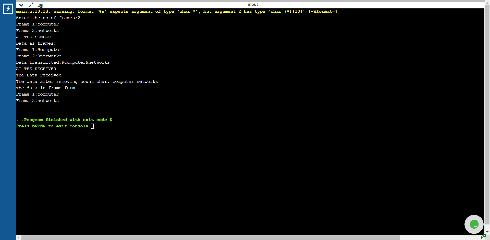

# Experiment 1- Character count

## Aim of the Experiment  
To implement data link layer framing methods character count

### Step by step procedure of the experiment
1.Scanning the number of frames and their details.
2.Counting the number of characters in each frame.
3.Printing the character count and the character.
4.Printing the characters without count.
5.Printing the data in the frame form.

### Output

